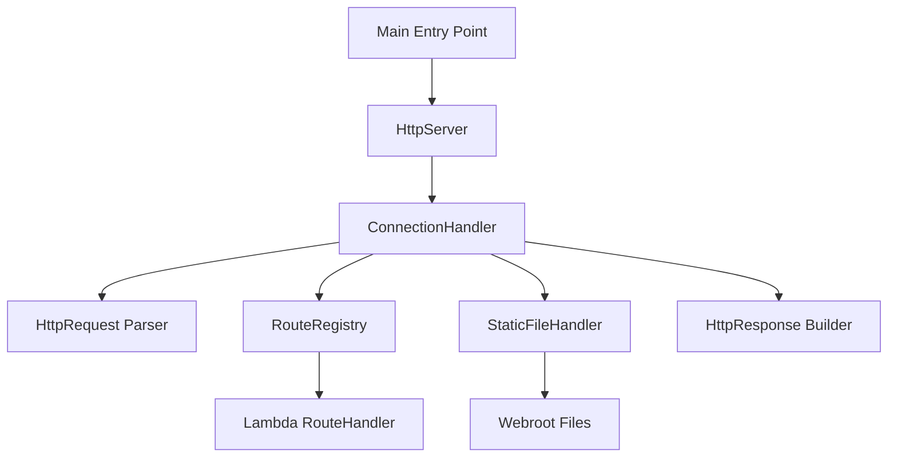
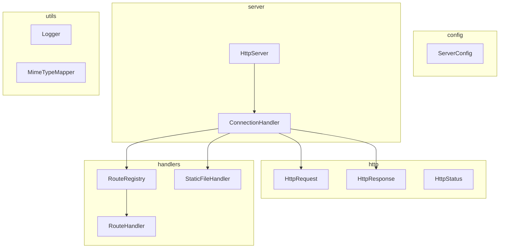
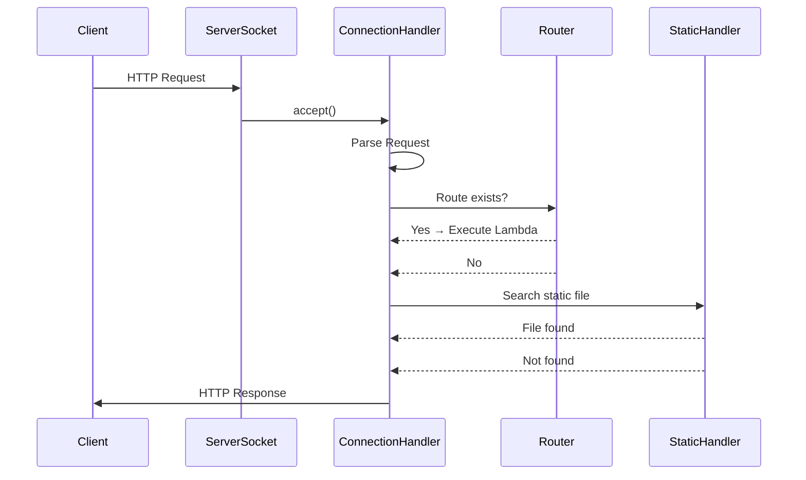
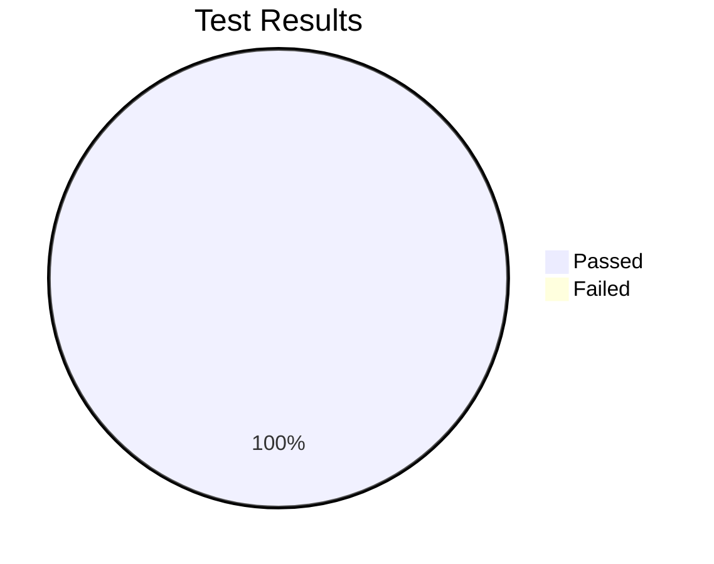

# Web Framework for REST Services and Static File Management

> Note: This project not only followed the academic work guide provided, but also leveraged the architecture proposed in the article [**Build Your Own HTTP Server in Java 21: From Raw Sockets to Static Sites**](https://medium.com/@ankitmaurya1994/build-your-own-http-server-in-java-21-from-raw-sockets-to-static-sites-04c3ec92371b) published on [_Medium_](https://medium.com/), which served as a conceptual reference for the structural design and modular organization of the implemented HTTP server.

[](https://github.com/RichardLitt/standard-readme)

A lightweight Java 21 web framework built from scratch using TCP sockets to support REST services through lambda expressions and static file management over HTTP.

This project evolves a basic HTTP server into a minimal yet extensible web framework capable of:

* Serving static files (HTML, CSS, JavaScript, images).
* Publishing REST services using a simple `get()` method.
* Extracting query parameters dynamically from HTTP requests.
* Handling HTTP errors (400 Bad Request, 404 Not Found).
* Providing a modular and layered architecture.
* Being fully validated with 71 successful automated tests.

The framework was developed as an academic project focused on understanding HTTP protocol architecture, distributed systems, and modern web service design principles.

## Table of Contents

* [Background](#background)
* [Architecture](#architecture)
* [Project Requirements and Scope](#project-requirements-and-scope)
* [Install](#install)
* [Usage](#usage)

    * [Defining REST Services](#defining-rest-services)
    * [Extracting Query Parameters](#extracting-query-parameters)
    * [Static File Configuration](#static-file-configuration)
    * [Example Application](#example-application)
* [Testing](#testing)
* [Project Structure](#project-structure)
* [Deliverables Compliance](#deliverables-compliance)
* [Outcome and Learning Results](#outcome-and-learning-results)
* [Maintainers](#maintainers)
* [License](#license)

## Background

The objective of this project was to transform an HTTP server capable of serving static files into a minimal yet extensible web framework.

The transformation required:

* Designing a developer-friendly API for REST endpoints.
* Implementing internal routing logic.
* Parsing HTTP requests manually.
* Extracting query parameters from URLs.
* Managing static file resolution within a configurable directory.
* Maintaining a clean and modular architecture.

The framework abstracts low-level socket and HTTP handling while exposing a simple functional interface for developers.

## Architecture

The system follows a modular and layered design that clearly separates concerns.

### High-Level Architecture



### Package-Level Architecture



### HTTP Request Flow



## Project Requirements and Scope

### Core Features Implemented

#### 1. GET Static Method for REST Services

Developers define REST services using:

```java
get("/hello", (req, res) -> "hello world!");
```

This maps URLs directly to handler logic using lambda expressions.

#### 2. Query Parameter Extraction

Example:

```java
get("/hello", (req, res) -> "hello " + req.getValues("name"));
```

Example request:

```
http://localhost:8080/App/hello?name=Pedro
```

The framework parses and exposes query parameters dynamically.

#### 3. Static File Location Specification

```java
staticfiles("/webroot");
```

Static files are resolved from:

```
src/main/resources/webroot
```

Supported resources include:

* `/index.html`
* `/styles.css`
* `/app.js`
* `/images/logo.svg`

#### 4. Example Application

```java
public static void main(String[] args) {
    staticfiles("/webroot");

    get("/hello", (req, resp) -> 
        "Hello " + req.getValues("name"));

    get("/pi", (req, resp) -> 
        String.valueOf(Math.PI));
}
```

Example endpoints:

* `http://localhost:8080/App/hello?name=Santiago`
* `http://localhost:8080/App/pi`
* `http://localhost:8080/index.html`

## Install

### Requirements

* Java 21+
* Maven
* Git

### Build Project

```sh
mvn clean install
```

## Usage

### Run the Server

```sh
mvn exec:java
```

Or run the main class from your IDE.

Server runs at:

```
http://localhost:8080
```

## Testing

The project includes a structured test directory mirroring the main architecture:

```
src/test/java/co/edu/escuelaing
```

### Test Coverage

A total of **71 automated tests** were implemented and all passed successfully.



Tests validate:

* HTTP request parsing
* Query parameter extraction
* Route resolution
* Static file handling
* MIME type detection
* 404 Not Found behavior
* 400 Bad Request handling
* Header construction
* End-to-end request lifecycle

### Run Tests

```sh
mvn test
```

### Execution Evidence

Screenshots are stored in:

```
/img/
```

#### Server Startup


#### GET /App/hello


#### GET with Query Parameter


#### GET /App/pi


#### Static File Served


#### CSS MIME Type Validation


#### JavaScript File Served (App.js)


#### 404 Not Found


#### Maven Test Execution


## Project Structure

```
.
├── pom.xml
├── src
│   ├── main
│   │   ├── java/co/edu/escuelaing
│   │   └── resources/webroot
│   ├── test
│   │   └── java/co/edu/escuelaing
├── img
└── README.md
```

The repository follows Maven conventions and professional modular design principles.

## Deliverables Compliance

This repository satisfies all academic project requirements:

* Public GitHub repository.
* Built using Maven and Git.
* Modular architecture.
* REST service definition using lambdas.
* Static file management.
* 71 automated tests successfully executed.
* Complete documentation including:

    * Architecture diagrams
    * Execution steps
    * Example usage
    * Testing validation
    * Screenshots directory

## Outcome and Learning Results

Upon completion, this project provided:

* Deep understanding of the HTTP protocol.
* Practical experience with socket-based server architecture.
* Knowledge of manual request parsing and response construction.
* Insight into routing mechanisms used in modern frameworks.
* Experience designing developer-friendly APIs.
* Understanding of how frameworks like Spring abstract networking complexity.

Building a web framework from scratch reinforces core distributed systems and networking principles that underpin modern backend development.
